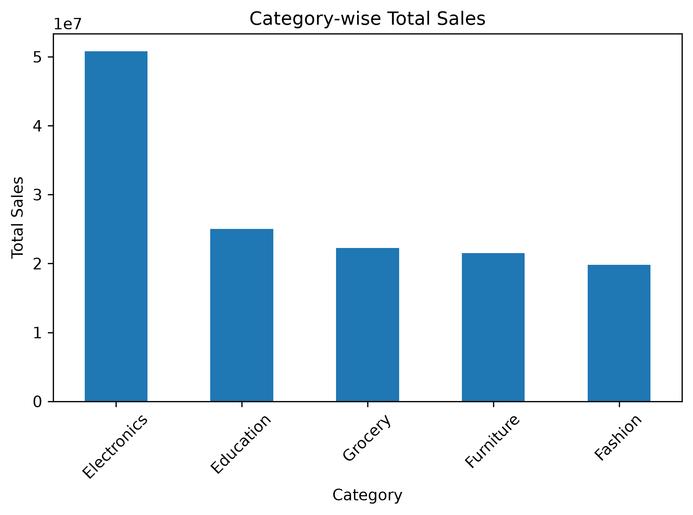
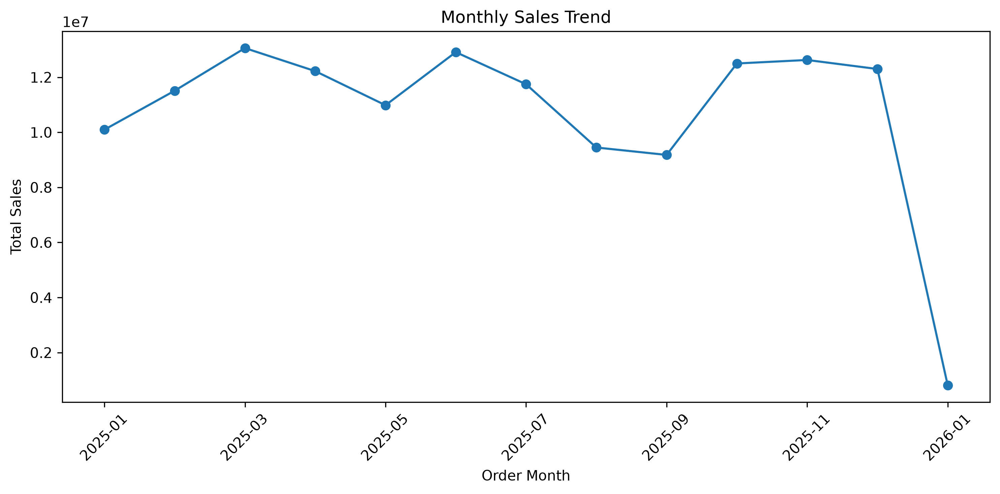
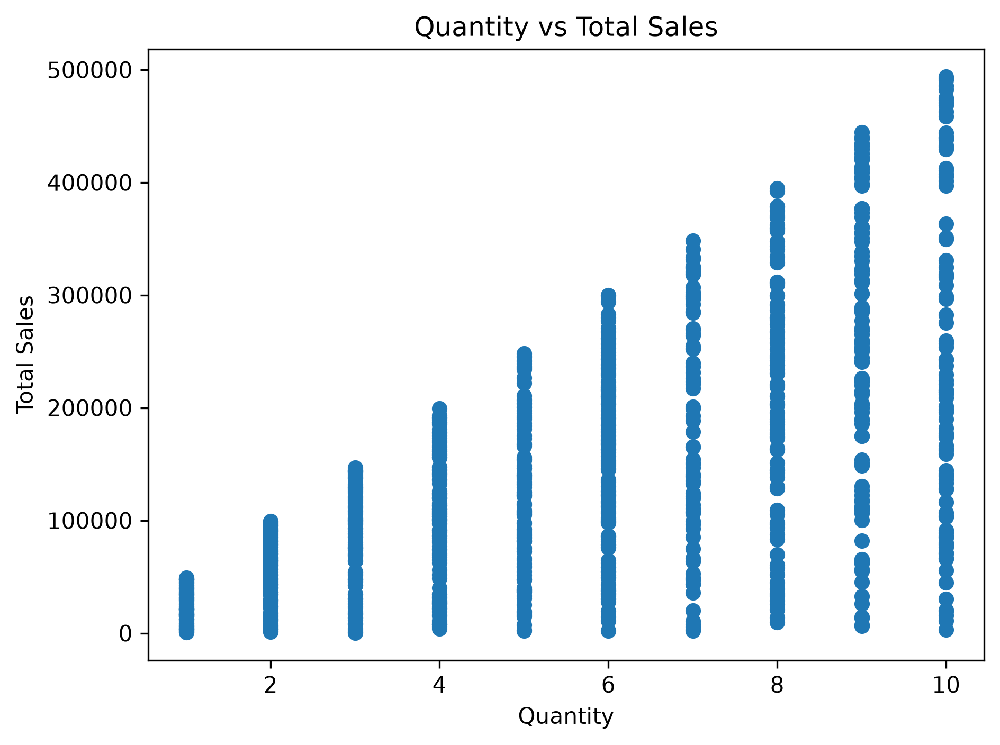
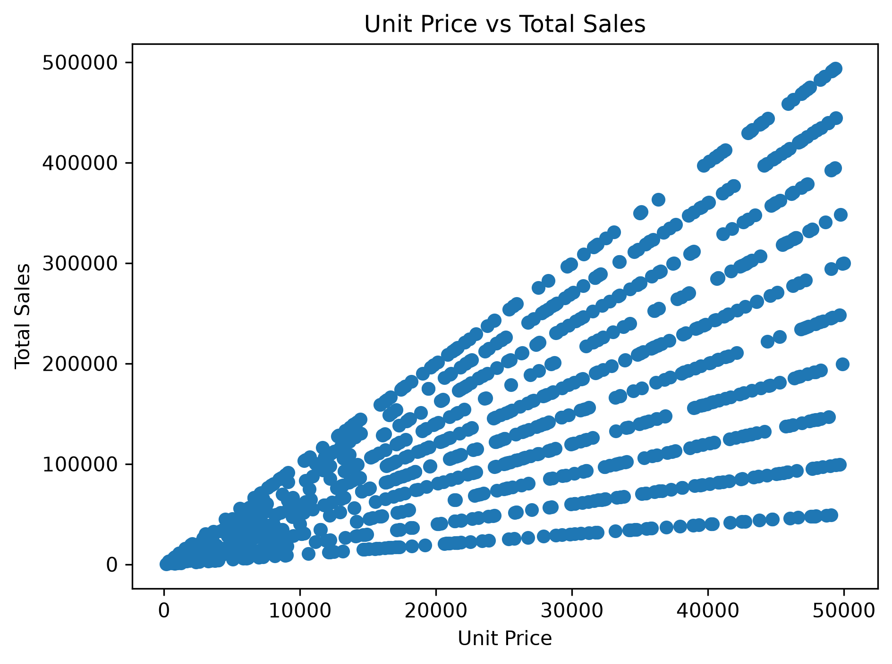
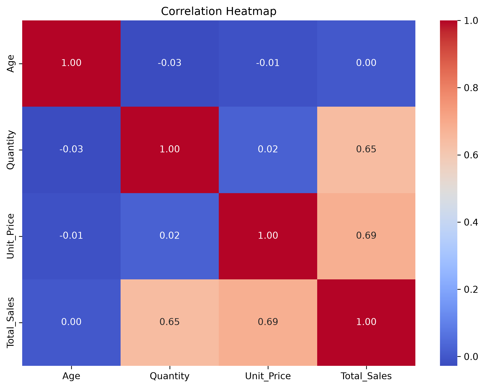
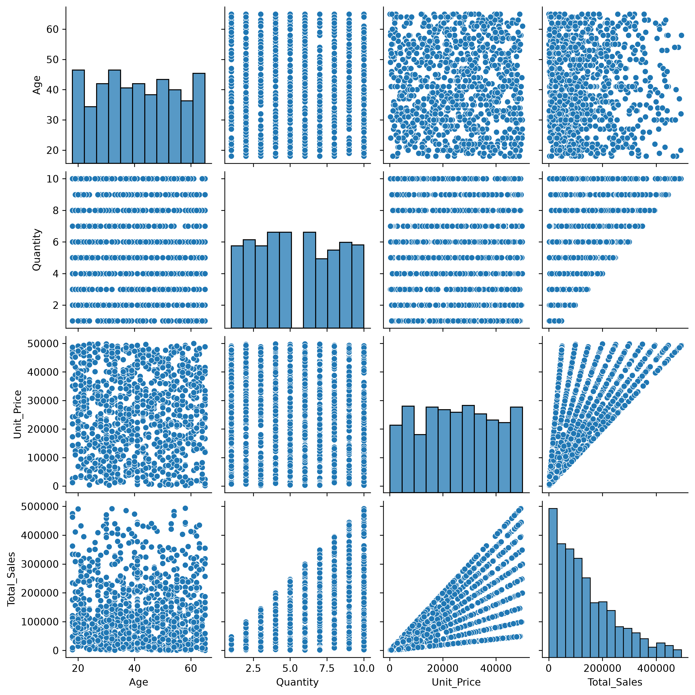

# Exploratory Data Analysis Report

## ApexPlanet Data Analytics Internship — Task 2

## 1. Project Overview

This report presents the exploratory data analysis performed on the cleaned sales dataset as part of the ApexPlanet Data Analytics Internship.

The analysis focuses on understanding sales performance, identifying patterns and trends, answering business questions using SQL, and presenting meaningful insights through visualizations and a static dashboard mock-up.

## 2. Objectives

- Perform descriptive statistics and univariate analysis.
- Identify sales patterns across categories, products, cities, and customer segments.
- Answer business questions using SQL.
- Analyze relationships between numerical variables.
- Perform correlation analysis using heatmaps and pair plots.
- Create a static dashboard mock-up to present important KPIs and business insights.

## 3. Dataset Overview

The analysis was performed using the cleaned sales dataset prepared during Task 1.

The dataset contains:

- 1,000 sales records
- Customer information
- Product and category details
- Quantity and unit price
- Total sales
- Order dates
- City and gender information

The cleaned dataset was used for Python-based analysis and was also imported into MySQL Workbench for SQL analysis.

## 4. Tools & Technologies

- Python
- Pandas
- NumPy
- Matplotlib
- Seaborn
- MySQL
- Excel
- PowerPoint

## 5. Section 1: Descriptive Statistics & Univariate Analysis

### 5.1 Data Inspection

The dataset was inspected to understand its structure, data types, and numerical and categorical variables.

The analysis included:

- Dataset shape and column information
- Data types
- Numerical summary statistics
- Categorical distributions

### 5.2 Numerical Summary

Descriptive statistics were calculated for the following numerical variables:

- Age
- Quantity
- Unit_Price
- Total_Sales

The `describe()` function was used to understand the central tendency, spread, minimum values, maximum values, and quartiles of the numerical variables.

### 5.3 Univariate Analysis

The following individual-variable analyses were performed:

- Gender distribution
- City distribution
- Product distribution
- Category distribution
- Age-group distribution
- Category-wise sales
- Monthly sales trend
- Product-wise sales
- City-wise sales
- Gender-wise sales
- Age-group sales

Histograms and bar charts were used to visualize the distributions and compare sales performance across different groups.

### 5.3.1 Category-wise Sales

Category-wise sales were analyzed to compare the contribution of different
product categories to overall sales.

**Insight:** Electronics generated the highest total sales, followed by
Education. This indicates that these categories contributed significantly
to overall revenue in the dataset.

### 5.3.2 Monthly Sales Trend

Monthly sales were analyzed to identify changes in sales performance over time.

**Insight:** March 2025 recorded the highest monthly sales in the dataset.
January 2026 contains partial-month data, so it should be interpreted with
caution.

### 5.4 Section 1 Findings

The univariate analysis helped identify differences in sales performance across categories, products, cities, and customer segments.

These findings were further explored through SQL queries and multivariate analysis.

## 6. Section 2: SQL for Business Questions

SQL was used to answer seven business-focused questions involving aggregation, grouping, sorting, conditional logic, and subqueries.

### Q1. Which product categories generate the highest total sales?

**Finding:** Electronics recorded the highest total sales, followed by Education.

| Category | Total Sales |
|---|---:|
| Electronics | ₹5.08 Cr |
| Education | ₹2.50 Cr |
| Grocery | ₹2.22 Cr |
| Furniture | ₹2.15 Cr |
| Fashion | ₹1.98 Cr |

### Q2. What are the top 5 products by total sales?

**Finding:** Laptop was the highest-selling product among the top five products, followed closely by Mobile and Book.

| Product | Total Sales |
|---|---:|
| Laptop | ₹2.54 Cr |
| Mobile | ₹2.53 Cr |
| Book | ₹2.50 Cr |
| Rice | ₹2.22 Cr |
| Chair | ₹2.15 Cr |

### Q3. How do sales change month by month?

**Finding:** March 2025 recorded the highest monthly sales in the dataset.

The monthly analysis also includes January 2026, which is a partial month in the available data.

### Q4. Which cities generate the highest total sales?

**Finding:** Patna recorded the highest total sales among the cities in the dataset.

| City | Total Sales |
|---|---:|
| Patna | ₹2.08 Cr |
| Kolkata | ₹1.89 Cr |
| Bengaluru | ₹1.88 Cr |
| Mumbai | ₹1.88 Cr |
| Hyderabad | ₹1.72 Cr |

### Q5. What is the average sales value per dataset record?

The average `Total_Sales` value across the dataset was approximately **₹1.39 lakh per record**.

This represents the average sales value of a dataset record, not necessarily a unique customer order.

### Q6. How are customers distributed across age segments?

Customers were grouped into the following age segments using SQL `CASE` logic:

- Young Adult
- Adult
- Senior

The query calculates the number of records and total sales for each segment.

### Q7. Are there products with high sales volume but relatively low revenue?

The query compared each product's total quantity and total sales against their respective averages.

**Finding:** No product satisfied both conditions used in the query:

- Higher-than-average sales quantity
- Lower-than-average total sales

This indicates that the selected criteria did not identify a product with simultaneously high volume and relatively low revenue.

## 7. Section 3: Multivariate Analysis & Correlation

The following visualizations were created:

- Scatter plots
- Correlation matrix
- Correlation heatmap
- Pair plot

### 7.1 Quantity vs Total Sales

Quantity and Total_Sales show a moderate positive relationship.

**Correlation:** 0.646641

Higher quantities generally lead to higher total sales.

### 7.2 Unit Price vs Total Sales

Unit_Price and Total_Sales also show a moderate positive relationship.

**Correlation:** 0.686303

Products with higher unit prices generally contribute more to total sales.

### 7.3 Age vs Total Sales

Age has almost no correlation with Total_Sales.

**Correlation:** 0.001294

Customer age does not appear to strongly influence sales in this dataset.

### 7.4 Age vs Quantity

Age and Quantity show almost no relationship.

**Correlation:** -0.027666

Customer age does not strongly affect the quantity purchased.

### 7.5 Correlation Matrix and Heatmap

The correlation matrix and heatmap provide an overview of relationships between the numerical variables.

### 7.6 Pair Plot

The pair plot provides a combined visual view of the numerical variables and helps confirm the relationships observed in the correlation analysis.

### 7.7 Correlation Conclusion

Sales are more closely related to Quantity and Unit_Price than to Age in this dataset.

## 8. Section 4: Static Dashboard Mock-up

A static dashboard mock-up was created using PowerPoint.

The dashboard presents important KPIs and sales insights, including:

- Total Sales
- Total Records
- Total Quantity
- Average Sales per Record
- Category-wise Sales
- Top 5 Products by Sales

### Dashboard KPIs

| KPI | Value |
|---|---:|
| Total Sales | ₹13.94 Cr |
| Total Records | 1,000 |
| Total Quantity | 5,435 |
| Average Sales per Record | ₹1.39 L |

## 9. Key Findings

- Electronics is the strongest-performing category.
- Laptop is the highest-selling product among the top five products.
- March 2025 recorded the highest monthly sales.
- Patna recorded the highest total sales among the cities.
- Quantity and Unit_Price show stronger relationships with Total_Sales than Age.
- No product satisfied both the high-volume and low-revenue conditions used in the SQL query.

## 10. Overall Conclusion

The exploratory data analysis helped identify important sales patterns and relationships in the dataset.

Electronics emerged as the strongest-performing category, while Laptop was the highest-selling product among the top five products.

The correlation analysis showed that sales are more closely related to Quantity and Unit_Price than to customer Age.

The combination of Python, SQL, and dashboarding helped convert the sales dataset into meaningful business insights.

## 11. Project Files

- `eda_analysis.py` — Python-based exploratory data analysis
- `EDA_Report.md` — Detailed exploratory data analysis report
- `sql_queries.sql` — SQL business questions and queries
- `sql_setup.sql` — SQL database and table setup and data verification queries
- `dashboard.html` — HTML dashboard reference
- `ApexPlanet_Task_2_Sales_Analysis_Dashboard.pptx` — Static dashboard mock-up
- `cleaned_sales_dataset.csv` — Cleaned dataset used for analysis

## 12. How to Run

Install the required Python libraries:

    pip install pandas numpy openpyxl matplotlib seaborn

Run the EDA script:

    python eda_analysis.py

The SQL setup and business-question queries can be executed in MySQL Workbench using the imported `sales_data` table.

The cleaned CSV dataset was imported into MySQL Workbench using the Table Data Import Wizard.

The static dashboard mock-up is available in the PowerPoint file.