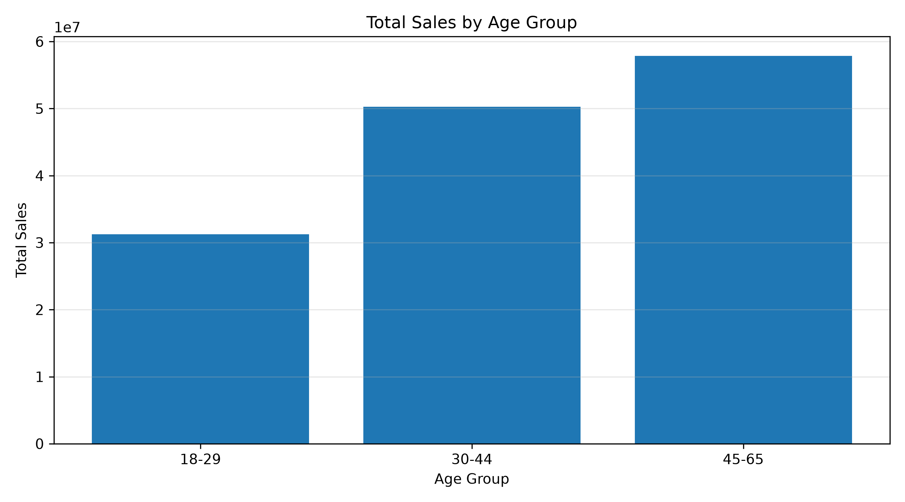
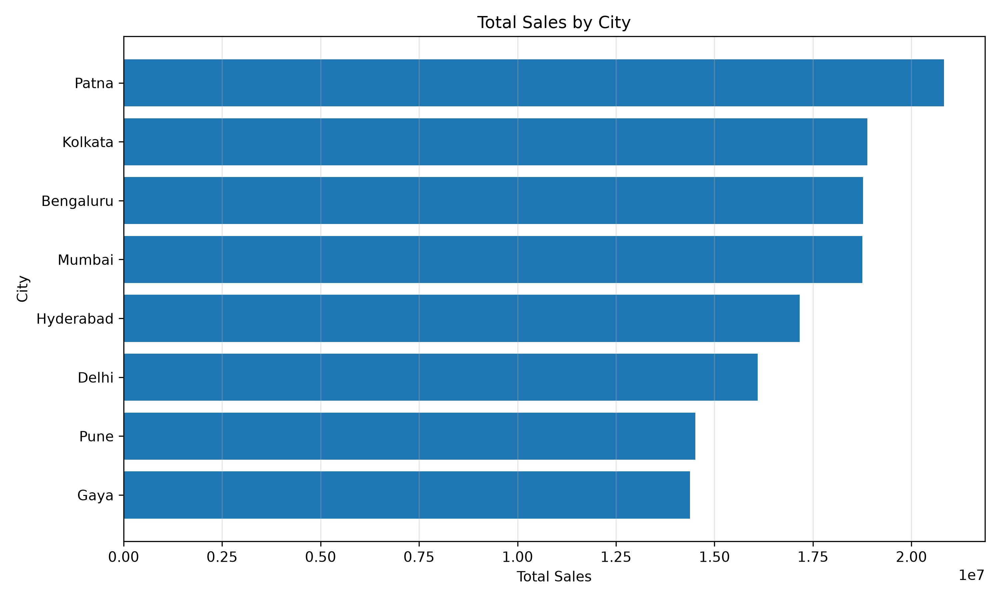
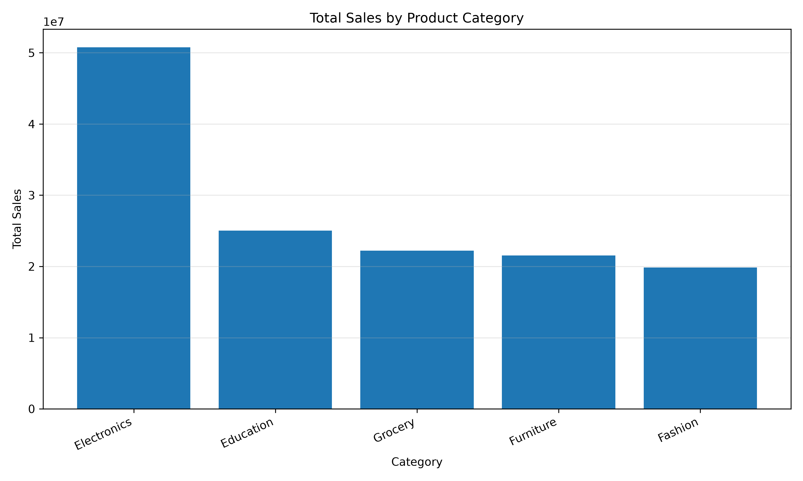

# Task 3: Deep-Dive Analysis & Interactive Dashboarding

## 1. Core Key Performance Indicators (KPIs)

The following KPIs are used to monitor overall sales performance and customer reach.

### KPI 1: Total Sales
- **Formula:** `SUM(Total_Sales)`
- **Business Rationale:** Measures the overall sales value generated and helps track business performance.
- **Result:** ₹139,399,439.65

### KPI 2: Total Quantity Sold
- **Formula:** `SUM(Quantity)`
- **Business Rationale:** Measures the total quantity of products sold and helps understand sales volume.
- **Result:** 5,435 units

### KPI 3: Average Unit Price
- **Formula:** `AVG(Unit_Price)`
- **Business Rationale:** Shows the average unit price across the dataset, helping understand the overall pricing level of products sold.
- **Result:** ₹25,486.78

**Additional analysis metrics:** Total Records and Average Sales per Record are also calculated in the Python analysis output. Average Sales per Record is not interpreted as Average Order Value because Order_ID values are repeated.

## 2. Deep-Dive Segmentation Analysis

### 2.1 Objective
The objective of this analysis is to understand sales performance across different customer age groups, cities, and product categories. This helps identify the segments contributing most to overall sales.

### 2.2 Analysis Approach
The cleaned sales dataset was analyzed using Python and Pandas. Sales and quantity were aggregated across:
- Customer age groups
- Cities
- Product categories
- Age group and category combinations

The analysis focused on total sales, sales contribution, quantity sold, and number of records.

### 2.3 Customer Age Group Analysis

Customers were grouped into three age ranges: 18–29, 30–44, and 45–65.

| Age Group | Total Sales | Quantity | Records | Sales Share |
|---|---:|---:|---:|---:|
| 18–29 | 31,265,459.92 | 1,262 | 233 | 22.43% |
| 30–44 | 50,275,604.90 | 1,978 | 349 | 36.07% |
| 45–65 | 57,858,374.83 | 2,195 | 418 | 41.51% |

**Key Insight:** The 45–65 age group contributes the largest share of sales (41.51%), followed by the 30–44 age group (36.07%). The 18–29 age group contributes 22.43%.

### 2.4 City-wise Sales Analysis

| City | Total Sales | Sales Share |
|---|---:|---:|
| Patna | 20,826,584.43 | 14.94% |
| Kolkata | 18,884,349.57 | 13.55% |
| Bengaluru | 18,773,574.32 | 13.47% |
| Mumbai | 18,757,050.17 | 13.46% |
| Hyderabad | 17,166,766.87 | 12.31% |
| Delhi | 16,097,079.00 | 11.55% |
| Pune | 14,513,175.90 | 10.41% |
| Gaya | 14,380,859.39 | 10.32% |

**Key Insight:** Patna records the highest sales contribution at 14.94%. Gaya records the lowest contribution among the eight cities at 10.32%.

### 2.5 Product Category Analysis

| Category | Total Sales | Sales Share |
|---|---:|---:|
| Electronics | 50,778,581.70 | 36.43% |
| Education | 25,031,689.40 | 17.96% |
| Grocery | 22,231,711.28 | 15.95% |
| Furniture | 21,521,561.48 | 15.44% |
| Fashion | 19,835,895.79 | 14.23% |

**Key Insight:** Electronics is the largest category, contributing 36.43% of total sales. Education is the second-largest category at 17.96%.

### 2.6 Business Observations

1. The 45–65 age group contributes the largest share of sales among the analyzed age groups.
2. Patna has the highest total sales among the cities in the dataset.
3. Electronics contributes over one-third of total sales.
4. Sales contributions are distributed across all eight cities, with each city contributing between approximately 10% and 15%.

### 2.7 Summary

The segmentation analysis highlights differences in sales contribution across age groups, cities, and product categories. The results provide a basis for exploring sales performance interactively through the Looker Studio dashboard.

## 3. Interactive Dashboard Build

### 3.1 Tool Used

Google Looker Studio was used to create an interactive sales performance dashboard based on the cleaned sales dataset.

### 3.2 Dashboard Components

The dashboard contains the following visual elements:

| Component               | Description                                              |
| ----------------------- | -------------------------------------------------------- |
| Total Sales             | Displays the total sales value                           |
| Total Quantity Sold     | Displays the total quantity of products sold             |
| Average Unit Price      | Displays the average unit price of products              |
| Sales Trend by Month    | Area chart showing monthly sales trends                  |
| Total Sales by City     | Bar chart comparing sales across cities                  |
| Total Sales by Category | Bar chart comparing sales across product categories      |
| Category Filter         | Allows users to filter the dashboard by product category |

### 3.3 Interactivity

A category filter was added to allow users to explore sales performance for individual product categories.

When a category is selected, the KPI scorecards and charts update according to the selected filter. Resetting the filter restores the overall dataset results.

This enables users to interactively explore sales performance across different product categories.

### 3.4 Dashboard Insights

The dashboard provides an interactive view of the following:

* Overall sales value and quantity sold.
* Average unit price of products.
* Monthly sales trends.
* Sales distribution across cities.
* Sales contribution by product category.
* Category-level filtering of the displayed results.

### 3.5 Dashboard Summary

The Looker Studio dashboard brings the key sales KPIs and segmentation findings together in one interactive view. Its category filter enables users to explore how sales performance changes across product categories.

The dashboard is available through the live Looker Studio report link.
[View the interactive Looker Studio Sales Dashboard](https://datastudio.google.com/reporting/87dbed6e-5b07-482f-a205-7854e8954b54)

## 4. Key Findings & Conclusion

### 4.1 Key Findings

* Total sales recorded in the dataset are ₹139,399,439.65.
* The 45–65 age group contributes the highest sales share at 41.51%.
* Patna has the highest city-wise sales contribution at 14.94%.
* Electronics is the leading product category, contributing 36.43% of total sales.
* The average unit price across the dataset is ₹25,486.78.
* The interactive category filter in Looker Studio allows users to explore sales performance for individual product categories.

### 4.2 Conclusion

This project applied customer and sales segmentation to examine sales performance across age groups, cities, and product categories.

Python and Pandas were used for data analysis, while Google Looker Studio was used to create an interactive dashboard. The dashboard brings key KPIs and sales visualizations together, allowing users to explore category-level performance.

The analysis provides a structured overview of the dataset and demonstrates how data analytics and interactive visualization can support business understanding.

### 4.3 Limitations

* The analysis is based on the available dataset and may not represent the complete business situation.
* The findings describe observed sales patterns and do not establish the causes behind them.
* The dataset contains repeated Order_ID values, so record-level averages should not be interpreted as average order value.
* January 2026 contains only partial-month data, so it should not be directly compared with complete months.

## 5. Supporting Visualizations

### 5.1 Sales by Age Group

This chart compares total sales across the three customer age groups and supports the age-group findings discussed in Section 2.3.

### 5.2 Sales by City

This chart compares total sales across the eight cities and highlights differences in city-wise sales contribution.

### 5.3 Sales by Product Category

This chart compares total sales across product categories and supports the category-level findings discussed in Section 2.5.